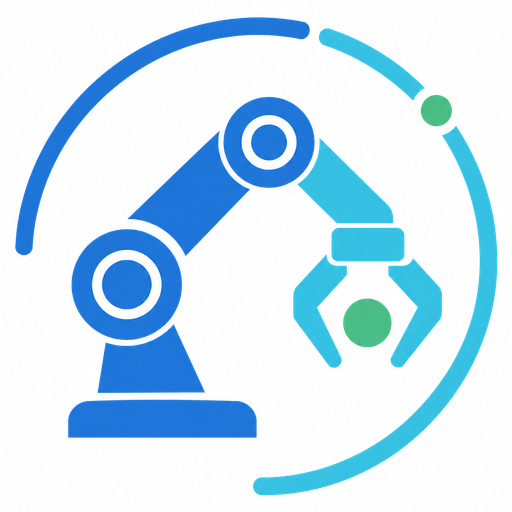
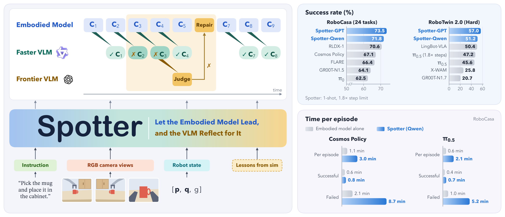
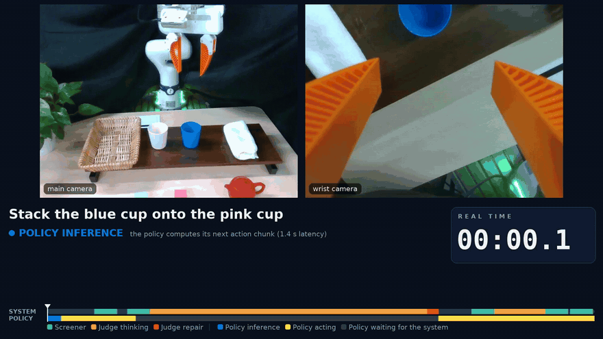

<p align="center">
  
</p>

<h1 align="center">Spotter: Let the Embodied Model Lead, and the VLM Reflect for It</h1>

<p align="center">If our project helps you, please give us a star ⭐ on GitHub to support us.</p>

<p align="center">
  <a href="./README.md"></a>
  <a href="./README_zh.md"></a>
</p>

<p align="center">
  <a href="https://arxiv.org/abs/2609.36808"></a>
  <a href="https://zqc3117.github.io/Spotter/"></a>
  <a href="./LICENSE"></a>
  <a href="https://robocasa.ai"></a>
</p>

| 📄 Paper | 🏠 Project page | 🤖 Model checkpoints | 🌐 Simulator | 🚀 Get started |
|---|---|---|---|---|
| [arXiv](https://arxiv.org/abs/2609.36808) | [zqc3117.github.io/Spotter](https://zqc3117.github.io/Spotter/) | [pi0.5](https://huggingface.co/DAVIAN-Robotics/pi05-robocasa-H50) · [Cosmos Policy](https://huggingface.co/nvidia/Cosmos-Policy-RoboCasa-Predict2-2B) | [RoboCasa](https://robocasa.ai) | [Installation](#-environment-setup) · [Quick start](#-evaluation-with-released-checkpoints) |

<p align="center">
  
</p>

**Spotter** adds a lightweight intervention layer between a frozen embodied model (System 1) and a VLM (System 2).
Instead of having the VLM plan every step, the embodied model leads and keeps executing, while a local screener
watches in parallel and the VLM steps in only to confirm and repair an error. The VLM's job becomes much simpler,
so the whole framework works with a **locally served, open-source Qwen and no privileged information**.

## 🎬 Demos

<p align="center">
  <a href="https://zqc3117.github.io/Spotter/#demos"></a>
</p>

<p align="center">Real robot (Franka Research 3), stacking the blue cup onto the pink cup. Shown at 2×, with the judge's thinking time shortened; the on-screen clock is real time.<br><a href="https://zqc3117.github.io/Spotter/#demos">Watch the full video on the project page</a>.</p>

## 🔥 Highlights

- **A lightweight intervention layer.** Like a person who keeps a little attention on a task and focuses only when
  something looks wrong, Spotter lets execution flow continuously and brings in the VLM only on a confirmed error.
- **A simpler job for the VLM.** The VLM no longer drives the robot. It only has to notice a failure, repair it with
  a short primitive plan, and check the fix. A local Qwen with no access to the task's success signal is enough.
- **Continuous execution, low overhead.** The embodied model never waits for the VLM on the routine path:
  a successful episode takes only **13–16 s** longer than the policy alone.

## 💡 Why Spotter

Existing VLM-led robot agents are serial: the VLM plans a segment, the embodied model executes it, and the VLM
decides what comes next. This forces a dilemma:

- **Short segments** mean frequent VLM calls and high latency, even on easy tasks.
- **Long segments** mean a deviation during execution cannot be caught in time, and later actions keep going wrong.

Spotter removes this trade-off by supervising in parallel rather than in series.

|  | VLM-led agents | Spotter |
|---|---|---|
| Who drives execution | VLM plans every step | Embodied model leads |
| When the VLM is called | Before every step | Only on a confirmed error |
| Embodied model waits for the VLM | Every step | Only during a repair |
| Needs privileged information | Usually (e.g. the success signal) | No |
| Works with a local Qwen | Only with privileged information | Yes |

### 🎯 Works with a weaker model, without privileged information

With the same local Qwen and no privileged information on RoboCasa (1,200 episodes), a representative VLM-led agent
falls **below the policy alone** (Cosmos Policy 67.9 → 65.2, π0.5 64.3 → 60.5), while Spotter still improves it
(→ 71.7 and 68.4).

### ⚡ Almost no overhead when nothing goes wrong

With Qwen, the judge is called **less than once** per successful episode on average, which adds only **13–16 s**
over the policy alone and takes about **70% less time** than a VLM-led agent using the same Qwen.

## 📑 Index

- [File Structure](#-file-structure)
- [Environment Setup](#-environment-setup)
- [Model Preparation](#-model-preparation)
- [Simulator Assets and Episode Sets](#-simulator-assets-and-episode-sets)
- [Evaluation with Released Checkpoints](#-evaluation-with-released-checkpoints)
- [Reproducing the Paper](#-reproducing-the-paper)
- [Building the Lesson Library and Example Bank](#-building-the-lesson-library-and-example-bank)
- [Plugging In Your Own Embodied Model](#-plugging-in-your-own-embodied-model)
- [Outputs](#-outputs) · [Configuration Reference](#-configuration-reference)
- [Acknowledgements](#-acknowledgements) · [License](#-license) · [Citation](#-citation)

## 📂 File Structure

```text
Spotter/
├── spotter.sh                        # one entry point: serve Qwen / the policy, run episodes, summarize
├── recovery_explore/                 # Spotter itself
│   ├── judge_driver_v7.sh            # supervision loop for one lane: screen -> judge -> repair -> verify
│   ├── env_service.py                # RoboCasa simulation service (RPC), started by launch_svc.sh
│   ├── primitives.py                 # motion primitives the judge composes repairs from
│   ├── JUDGE_BRIEF_V7.md             # judge prompt; BRIEF_PNP.md / BRIEF_MECH.md add task-family notes
│   ├── cli/                          # screener, judge channels (Qwen / GPT), harness, few-shot tools
│   ├── memory_bank/                  # frozen library of 77 general lessons
│   ├── episode_sets/                 # sall500.txt (paper, 1,200 episodes) · s500q96.txt (96, debugging)
│   ├── fewshot_bank/                 # (downloaded) worked examples for the 1-shot setting
│   └── runs_<RUN>_<family>/          # (generated) results.jsonl, per-lane logs, frames shown to the judge
├── rpc/                              # π0.5 policy server, RPC protocol, RoboCasa rollout and collection scripts
├── cf_bench/                         # snapshot and replay tools for the error-correction study
├── env/                              # env.sh.example, requirements-robocasa.txt, requirements-pi05.txt
├── assets/                           # logo
└── LICENSE · THIRD_PARTY_NOTICES.md · LICENSES/
```

## 🔧 Environment Setup

Spotter uses three Python environments:

| Environment | Python | Runs | Install |
|---|---|---|---|
| `robocasa` | 3.10 | simulation service, judge driver, Cosmos policy server | [Cosmos Policy](https://github.com/NVlabs/cosmos-policy) RoboCasa setup, then `env/requirements-robocasa.txt` |
| `pi05` | 3.12 | π0.5 policy server (LeRobot) | `env/requirements-pi05.txt` |
| `vllm` | 3.10+ | Qwen screener and judge | `pip install vllm` |

```bash
# 1) RoboCasa + Cosmos Policy: follow the RoboCasa setup of https://github.com/NVlabs/cosmos-policy, then
pip install -r env/requirements-robocasa.txt

# 2) π0.5
python3.12 -m venv .venvs/pi05 && .venvs/pi05/bin/pip install -r env/requirements-pi05.txt

# 3) vLLM for Qwen
python3 -m venv .venvs/vllm && .venvs/vllm/bin/pip install vllm

# 4) Point Spotter at your installs
cp env/env.sh.example env/env.sh && $EDITOR env/env.sh
```

> **Note.** Headless MuJoCo rendering needs an EGL-capable NVIDIA GPU (`MUJOCO_GL=egl`, set in `env/env.sh`).

## 📦 Model Preparation

**1) Download the weights.**

```bash
huggingface-cli download DAVIAN-Robotics/pi05-robocasa-H50         --local-dir checkpoints/pi05-robocasa-H50
huggingface-cli download nvidia/Cosmos-Policy-RoboCasa-Predict2-2B --local-dir checkpoints/Cosmos-Policy-RoboCasa-Predict2-2B
huggingface-cli download Qwen/Qwen3.8-27B-FP8                      --local-dir checkpoints/Qwen3.8-27B-FP8
```

**2) Expected layout.**

```text
checkpoints/
├── pi05-robocasa-H50/                        # model.safetensors, config.json, policy_*processor*, tokenizer/
├── Cosmos-Policy-RoboCasa-Predict2-2B/       # Cosmos-Policy-RoboCasa-Predict2-2B.pt, robocasa_t5_embeddings.pkl, ...
└── Qwen3.8-27B-FP8/
```

**3) Set in `env/env.sh`:**

```bash
export PI05_CHECKPOINT=$PWD/checkpoints/pi05-robocasa-H50
export COSMOS_CHECKPOINT=$PWD/checkpoints/Cosmos-Policy-RoboCasa-Predict2-2B/Cosmos-Policy-RoboCasa-Predict2-2B.pt
export QWEN_MODEL=$PWD/checkpoints/Qwen3.8-27B-FP8
export VLLM_VENV=$PWD/.venvs/vllm
```

**4) Example bank for the 1-shot setting (optional, 151 MB).**

```bash
curl -L https://github.com/zqc3117/Spotter/releases/download/v1.0/fewshot_bank.tar.gz | tar -xz -C recovery_explore
```

> **GPT judge (optional).** Set `ENGINE=api` together with `OPENAI_RESPONSES_URL` and `OPENAI_API_TOKEN_FILE`;
> the judge becomes GPT-6 Astra while the screener stays the local Qwen.

## 🧭 Simulator Assets and Episode Sets

**RoboCasa assets** are installed by the Cosmos Policy RoboCasa setup above.

**Episode sets** ship with the repository, one `TASK:SEED:EPISODE` per line:

| File | Episodes | Use |
|---|---:|---|
| `episode_sets/sall500.txt` | 1,200 | paper evaluation: 24 tasks × episodes 0–49, seed 500 |
| `episode_sets/s500q96.txt` | 96 | debugging subset, 4 episodes per task |

Lessons and worked examples were learned on seed 195, disjoint from the test seed.
**RoboTwin 2.0 and the real-robot experiments** are not included in this release.

## 🚀 Evaluation with Released Checkpoints

Each server runs in its own terminal after `source env/env.sh`.

**1) Serve the Qwen screener and judge** (one replica per GPU, ports 8301, 8302, ...).

```bash
bash spotter.sh judge --gpus 0,1,2,3
curl -s http://127.0.0.1:8301/v1/models        # check
```

With fewer GPUs, pass fewer ids (e.g. `--gpus 0`) and `export QWEN_PORTS=8301` before running.

**2) Serve the embodied model**: π0.5 on port 8900 or Cosmos Policy on port 8800.

```bash
bash spotter.sh policy pi05 --gpu 4             # or: bash spotter.sh policy cosmos --gpu 4
curl -s http://127.0.0.1:8900/health           # check
```

**3) Smoke test: one episode.** The driver starts the simulation service by itself.

```bash
bash spotter.sh run pi05                        # one episode, control and Spotter on the same scene
```

**4) Full evaluation on `sall500`.**

```bash
bash spotter.sh run pi05 sall500 --lanes 8
bash spotter.sh summary
```

| Option | Meaning |
|---|---|
| `SET` | `smoke` (1 episode, default), `s500q96`, `sall500`, or a file with one `TASK:SEED:EPISODE` per line |
| `--lanes N` | episodes run in parallel; lane `N` runs its own simulation service on port `8450+N` |
| `--sim-gpus N` | GPUs the simulation services share, GPU `0..N-1` (default: all) |
| `--arm` | `both` (control and Spotter on each episode, default), `treat` (Spotter only), `ctrl` (policy only) |
| `--one-shot` | add one worked example to the judge (needs the example bank) |
| `--run NAME` | run name (default `<family>_<set>`); rerunning the same name resumes it |
| `--dry-run` | print the commands without running them |

Both arms of an episode share the same scene, instruction and step budget:

| Arm | Description |
|---|---|
| **Control** | Policy only; no judge calls. |
| **Treatment** | Policy plus judge and optional interventions. |

<details>
<summary>Running the driver directly</summary>

`spotter.sh run` launches one driver per lane. The single-episode pi0.5 run above is equivalent to:

```bash
mkdir -p recovery_explore/runs_smoke
printf 'PnPCabToCounter:195:0\n' > recovery_explore/runs_smoke/episodes_pi05.txt
ON_POD=1 RUN=smoke TARGET=1 NGPU=1 FAMILY_OVERRIDE=pi05 \
SIM_HOST=127.0.0.1 SIM_MANAGED=0 POLICY_URL=http://127.0.0.1:8900 \
ENGINE=qwen MODEL=qwen38 SCREEN=1 QWEN_KEEP_TURNS=20 \
STEP_BUDGET_SCALE=1.8 WINDOW=1 TEL_CHUNKS=10 COMPACT_AT=110000 MAX_INTERVENTIONS=8 \
ALLOW_RESET=0 MAX_RESETS=0 FEWSHOT=0 LEARN=0 CTRL_ONLY=0 SKIP_CONTROL=0 \
  bash recovery_explore/judge_driver_v7.sh 0
```

The driver starts and restarts the simulation service on port `8450+lane` by itself. All lanes of a run
claim episodes from the same queue, and each lane stops once the run has `TARGET` results.
</details>

## 📊 Reproducing the Paper

The Spotter rows of Table 1 (RoboCasa, 1,200 episodes) are the full evaluation above with these settings;
variables are exported before `spotter.sh run`.

| Table 1 row | Settings |
|---|---|
| Embodied model, 1.0× / 1.8× step limit | `--arm ctrl` with `STEP_BUDGET_SCALE=1.0` / `1.8` |
| Spotter (Qwen), full context | `spotter.sh` defaults |
| Spotter (Qwen), short context | `TEL_CHUNKS=3 QWEN_KEEP_TURNS=3 COMPACT_AT=22000 MAX_INTERVENTIONS=3 SCREEN_CONFIRM2=0` (π0.5 also `WINDOW=2`) |
| Spotter (Qwen), 1-shot | `--one-shot` |
| Spotter (GPT), with / no screener | `ENGINE=api` with `SCREEN=1` / `SCREEN=0` |
| Spotter (GPT), 1-shot | `ENGINE=api` and `--one-shot` |
| Harness VLA | run with its own code: [RLinf/RPent](https://github.com/RLinf/RPent) |

The fixed-retry rows of Table 1 are not included in this release.

**Supervision mode.** `spotter.sh` runs the synchronous supervision loop (`ASYNC_SCREEN=0`). For the bounded
asynchronous mode of Section 3.2, set `ASYNC_SCREEN=2 ASYNC_K=2`: the policy runs at most two supervision windows
ahead of the last check (4 chunks on Cosmos Policy, 2 on π0.5).

**Time.** `results.jsonl` logs the wall-clock time of each arm and of the judge and screener calls (see
[Outputs](#-outputs)); token counts are not logged by this release.

**Section 3.1.** `rpc/run_remote_robocasa_cf_branch_collect.py` collects the post-failure and normal candidates, and
`cf_bench/` replays them and runs the language-feedback protocol. The test-time scorers (Consistency-Consensus,
GeoBoN, RCS) are not included.

## 🧠 Building the Lesson Library and Example Bank

The released library (77 general lessons in `recovery_explore/memory_bank/global/`) and the example bank are frozen
and used as-is for every paper result; this section is only needed to rebuild them or to cover new tasks.

**1) Run learning episodes** on seed 195, never on the test seed. Only here may the judge reset and retry; each
episode writes its lessons as drafts to `memory_bank/inbox/<cell>/`.

```bash
ENGINE=api LEARN=1 ALLOW_RESET=1 MAX_RESETS=5 bash spotter.sh run cosmos <seed-195 episode file> --run learn_cosmos
```

**2) Review the drafts** and move the general ones into `memory_bank/global/`, following the lesson format in
`recovery_explore/memory_bank/README.md`. Remove anything privileged or task-specific.

**3) Build the example bank** for the 1-shot setting from the learning runs:

```bash
python3 recovery_explore/cli/fewshot_build.py --family cosmos --seed 195 --out recovery_explore/fewshot_bank
```

## 🔌 Plugging In Your Own Embodied Model

Spotter never trains the policy, so a new embodied model only needs to be served and registered:

1. **Serve it over the same RPC interface** as `rpc/policy_server_pi05.py`: `GET /health`, and `POST /v1/infer`
   taking an `InferenceRequest` (task description, seed, observation images and state) and returning an
   `InferenceResponse` with an action chunk (see `rpc/protocol.py`).
2. **Register the family** next to `cosmos` and `pi05`: action dimension and steps per chunk in
   `recovery_explore/cosmos_call.py` and `env_service.py`, service launch in `launch_svc.sh`, port and defaults in `spotter.sh`.
3. **Choose the supervision granularity**: `WINDOW` (chunks per screening check) and `TEL_CHUNKS` (telemetry rows
   shown to the judge).
4. **Run** `bash spotter.sh run <your-family> ...`.

## 📈 Outputs

```text
recovery_explore/runs_<RUN>_<family>/
├── results.jsonl          # one line per episode
├── lane<N>/driver.log     # per-lane progress
└── lane<N>/jd-.../w<k>/   # frames shown to the judge in window k
```

| Field | Meaning |
|---|---|
| `task`, `seed`, `episode` | the episode |
| `control_success` / `treatment_success` | success of the policy alone / with Spotter |
| `interventions`, `judge_calls`, `screened_windows` | repairs executed, judge calls, windows the screener passed |
| `ctrl_s`, `treat_s` | wall-clock seconds of the control and Spotter arms (`-1` if the arm was skipped) |
| `model_s`, `screen_s` | seconds spent in judge calls and in screener calls |
| `stale_steps`, `stale_ivs` | asynchronous mode only: steps and repairs made on an out-of-date window |

```bash
bash spotter.sh summary            # all runs
bash spotter.sh summary pi05_sall500
```

## 🧩 Configuration Reference

| Setting | Cosmos | pi0.5 |
|---|---:|---:|
| `FAMILY_OVERRIDE` | `cosmos` | `pi05` |
| Steps per chunk | 16 | 25 |
| `WINDOW` (judge window, in chunks) | 2 | 1 |
| `TEL_CHUNKS` | 40 | 10 |
| Policy port | 8800 | 8900 |
| Policy server | `python -m rpc.server` (upstream Cosmos Policy) | `python -m rpc.policy_server_pi05` |

| Parameter | Paper value | Purpose |
|---|---:|---|
| `STEP_BUDGET_SCALE` | `1.8` | Step budget multiplier; same value for control and treatment. |
| `SCREEN` | `1` | Screener on; `0` calls the judge every window. |
| `SCREEN_CONFIRM2` | `1` | Call the judge after two consecutive flags; `0` after one. |
| `MAX_INTERVENTIONS` | `8` | Maximum interventions per episode. |
| `ALLOW_RESET` / `MAX_RESETS` | `0` / `0` | Disable rollbacks so episodes stay comparable. |
| `ENGINE` / `MODEL` | `qwen` / `qwen38` | Local Qwen judge; `ENGINE=api` for GPT-6 Astra. |
| `COMPACT_AT` | `110000` | Qwen conversation compaction threshold (tokens). |
| `QWEN_KEEP_TURNS` | `20` | Recent judge turns kept in full. |
| `FEWSHOT` | `0` | `1` adds one worked example (`--one-shot`); needs the example bank. |

Qwen thinks only in the repair turns of an intervention, up to `QWEN_THINK_BUDGET` (default `2000`) tokens per call; the screener and the window verdict never think, and `QWEN_REPAIR_THINK=0` turns thinking off everywhere, as in the paper.

How the judge is paced has its own switches, all off or conservative by default:

| Variable | Default | Effect |
|---|---:|---|
| `ASYNC_SCREEN` | `0` | `1` lets the policy keep stepping while the judge works; the loop then resumes at the newest finished window. Faster, but the judge is looking at a window the episode has already moved past — `results.jsonl` records that cost as `stale_steps` and `stale_ivs`. `2` also holds the policy within `ASYNC_K` windows of the last check. |
| `MISS_GRACE` | `2` | Windows the policy gets to retry on its own after closing on nothing, before the judge may take over. |
| `FIRST_IV_FRAC` | `35` | The first intervention waits until the policy has closed on nothing at least once, or the episode is this far (%) into its step budget. `0` disables the gate. |
| `MONITOR_AFTER_BUDGET` | `1` | Keep calling the judge once the intervention budget is spent, for the record. `0` stops calling it. |

Changing `STEP_BUDGET_SCALE`, `WINDOW` or the policy family changes the experiment; compare runs by matched
task/seed/episode, not only by aggregate success rate.

## 🙏 Acknowledgements

- [RoboCasa](https://robocasa.ai): the simulation benchmark and assets we evaluate on.
- [Cosmos Policy](https://github.com/NVlabs/cosmos-policy): the released RoboCasa checkpoint and its policy server.
- [π0.5](https://huggingface.co/DAVIAN-Robotics/pi05-robocasa-H50) and [LeRobot](https://github.com/huggingface/lerobot): the RoboCasa π0.5 checkpoint and the library that loads it.
- [Qwen](https://huggingface.co/Qwen) and [vLLM](https://github.com/vllm-project/vllm): the local screener and judge.
- [RPent](https://github.com/RLinf/RPent): parts of `recovery_explore/` are adapted from it (Apache-2.0, see `THIRD_PARTY_NOTICES.md`).

## 📜 License

This project is released under the [MIT License](LICENSE). Some files in
`recovery_explore/` are adapted from RPent and remain under the Apache License 2.0; see
[THIRD_PARTY_NOTICES.md](THIRD_PARTY_NOTICES.md).

## 📖 Citation

```bibtex
@article{li2026spotter,
  title   = {Spotter: Let the Embodied Model Lead, and the VLM Reflect for It},
  author  = {Li, Long and Zhao, Qichao and Yang, Yue and Xu, Fan and Wang, Zhe and Liew, Alan Wee-Chung and Qu, Chao and Shen, Heng Tao and Pan, Shirui},
  journal = {arXiv preprint arXiv:2609.36808},
  year    = {2026}
}
```
